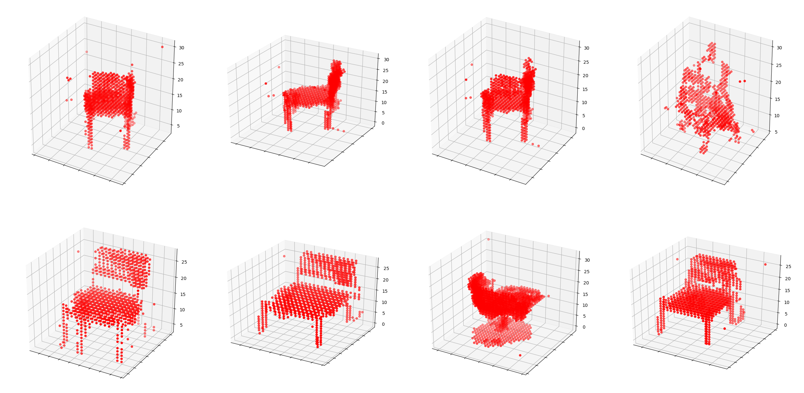

# 3DGAN-Pytorch

[](https://github.com/meetshah1995/tf-3dgan/blob/master/LICENSE)
[](https://arxiv.org/abs/1610.07584)


## Pytorch implementation of 3D Generative Adversarial Network.

This is a Pytorch implementation of the paper "Learning a Probabilistic Latent Space of Object Shapes 
via 3D Generative-Adversarial Modeling". I reference [ tf-3dgan](https://github.com/meetshah1995/tf-3dgan)  and translate to pytorch code, Difference is that i use output layer of sigmoid, soft-labelling, learning-rate scheduler. I think all input voxels is positive( 0 or 1), so sigmoid is better than tanh. soft-labelling is good for smoothing loss, I use learning-rate decay to get better quality output 

### Requirements

* pytoch
* scipy
* scikit-image

### Usage

I use [floydhub](https://www.floydhub.com/) to train model   
Floydhub is simple deeplearining training tool  
They offer free-tier for 100h gpu server
```
pip install -U floyd-cli
```

```
#./input
floyd data init chair
floyd data upload
```
```
#./3D_GAN
floyd init 3dgan
floyd data status
floyd run --env pytorch --gpu --data [your data id] "python3 main.py"
```

This porject structure is fitted with floydhub structure, so parent directory contain input, output, 3D_GAN directory  

### GAN Trick
I use some more trick for better result
* the loss function to optimize G is `min (log 1-D)`, but in practice folks practically use `max log D`
* Z is Sampled from a gaussian distribution [0, 0.33]
* Use Soft Labels - It make loss function smoothing (When I don't use soft labels , I observe divergence after 500 epochs)
* learning rate scheduler - after 500 epoch, descriminator's learning rate is decayed

If you want to know more trick , 
go to  [Soumith’s ganhacks repo.](https://github.com/soumith/ganhacks)

### Result
1000 epochs

</img>

</img>

### Reference

[ tf-3dgan](https://github.com/meetshah1995/tf-3dgan)  
[yunjey's pytorch-tutorial](https://github.com/yunjey/pytorch-tutorial)
